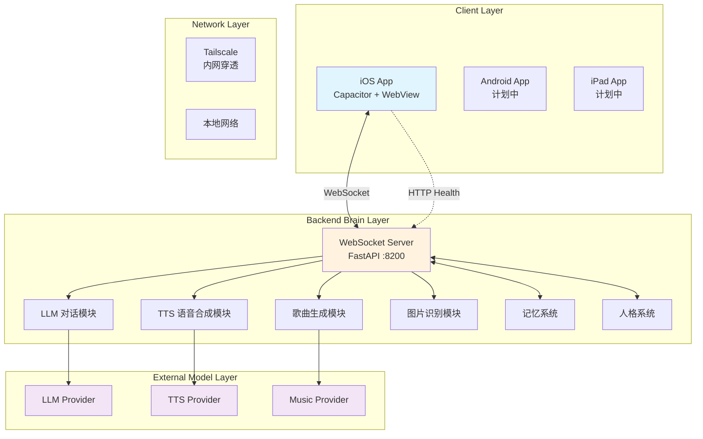

# 架构说明

## 系统架构总览



## 各层详细说明

### Client Layer（客户端层）

| 组件 | 说明 |
|------|------|
| iOS App | 基于 Capacitor 的混合应用，WebView 渲染前端 UI |
| 前端 UI | HTML/CSS/JS，负责消息展示、输入交互、音频播放 |
| WebSocket 客户端 | 连接后端，实时收发消息 |
| 音频播放器 | 播放 TTS 语音和歌曲 |
| 图片/贴纸组件 | 发送和接收图片、表情、贴纸 |

### Backend Brain Layer（后端大脑层）

| 组件 | 说明 |
|------|------|
| WebSocket Server | FastAPI + WebSocket，管理客户端连接 |
| LLM 对话模块 | 调用大语言模型，流式生成回复 |
| TTS 语音合成 | 将文本转为语音，推送音频流 |
| 歌曲生成模块 | 调用音乐生成 API，返回 MP3 文件 |
| 图片识别模块 | 接收图片，调用视觉模型识别内容 |
| 记忆系统 | 本地文件存储长期记忆、日记、人格配置 |
| 人格系统 | SOUL.md + MEMORY.md，定义 AI 的性格和记忆 |

### Network Layer（网络层）

| 组件 | 说明 |
|------|------|
| Tailscale | 内网穿透，让手机远程访问 Mac mini 后端 |
| 本地网络 | 局域网内直接连接，延迟最低 |

## 通信协议

### WebSocket 消息格式

```json
// 客户端 → 服务端
{
  "type": "user_text",
  "text": "你好星眠"
}

// 服务端 → 客户端
{
  "type": "llm_token",
  "text": "你好"
}

{
  "type": "tts_audio",
  "audio_b64": "base64编码的音频数据",
  "mime": "audio/mp4"
}

{
  "type": "song_ready",
  "song_url": "http://<backend-host>:8200/media/songs/{id}.mp3",
  "title": "歌曲名",
  "artist": "星眠"
}
```

### 连接流程

```
1. App 启动
2. 健康检查: GET http://<backend-host>:8200/health
3. 建立 WebSocket: ws://<backend-host>:8200/ws?api_key=<key>
4. 连接成功 → 显示"星眠在线"
5. 用户发送消息 → WebSocket 推送 → LLM 处理 → 流式返回
6. TTS 合成 → WebSocket 推送音频 → App 播放
7. 连接断开 → 自动重连（3秒间隔）
```

## 安全设计

- API Key 通过环境变量注入，不硬编码
- WebSocket 连接需要 api_key 认证
- 后端地址通过配置或 localStorage 设置
- iOS ATS 配置允许明文 HTTP（仅开发期）
- 所有敏感文件不提交到公开仓库
